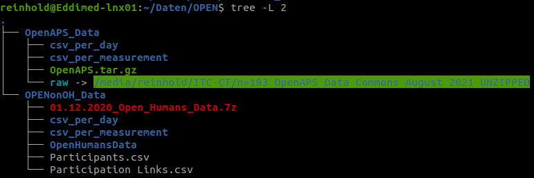

```
start date: 20.1.2022
last edit: 28.2.2022
author: Bernd Reinhold
```
# README.md for analyzing the OPENonOH and OpenAPS data sets

## process flow


## 0. preparation

### folder structure

- **csv_per_measurements** contains files, where one entry corresponds to one measurement of the sensor/device, etc.
- **csv_per_day** contains files, where one entry corresponds to the aggregate per day

Please create this data structure manually.

**ToDo: need to create a directory structure as part of the preprocessing**

### dependencies
```
pip3 install -r requirements.txt
```
(requirements.txt was generated with `pipreqs .` + some manual adjustment)

## 1. preprocessing step: `python3 preprocessing.py`
preprocessing.py takes the json.gz files of OPENonOH_Data, gunzips them to json-files and selects **noise, sgv, date, dateString** and writes them into csv-files in the _csv_per_measurement_-subdirectory.

Preprocessing.ipynb took rather long (maybe 20 min) to process all 161 entries_*.json.gz files. Therefore the switch to a python script 
_Possible improvement: only a subset of all variables is stored in the csv-output files, store all variables._

One entry in the csv output file is one measurement. One file corresponds to one json file. 

_Maybe one could also share these csv-files in the google drive?_

Some statistics on the output is provided in [csv_statistics_count_days.txt](csv_statistics_count_days.txt): Total: more than 8 Million measurements

## 2. aggregation_step.ipynb: aggregate into statistics per days: mean, rms (or stddev), min, max, count
Read the csv-files in csv_per_measurement as input.
Output is one csv-file containing approx. 8000 lines, with the aggregate per days and statistical variables.
(Aggregate per week is possible as well.)

_Paths need to be adjusted to your local environment._

## 3. duplicates: combine with the OpenAPS data file in a smart way.
Basic idea: if the statistical variables per day are very __"similar"__ in both datasets (OpenAPS and OPENonOH), then these are duplicate candidates. A distance metric to define __"similar"__ needs to be worked out.

The algorithm to detect duplicates applied here is a join by date between the Open Humans and the OpenAPS data commons dataset and then calculating the quadratic difference between the daily mean(plasma glucose), stddev, min, max and requiring a certain threshold.
A requirement here is that datetimes are consistent in both datasets, otherwise the daily mean, stddev, min, max are different even if the underlying data is identical except for the offset in time. An offset in time could lead to false negatives. This is achieved by calculating a UTC time from the unix_timestamps ("date"-column) and taking the date from that UTC timestamp.

False positives could arise if the threshold is chosen too loose.  

_Paths need to be adjusted to your local environment._

## naming conventions
following: https://pythonguides.com/python-naming-conventions/

functions and variables: snake case
classes: camelCase, 
	starting with a lowercase letter

## Datasets

### OpenAPS Data Commons
Compressed: 9.6 GB
Uncompressed: ~120 GB (!) 

## tested with
python 3.8.10
pandas v1.9.1
numpy v1.19.4

see requirements.txt (ToDo)


## known issues
when running `duplicates.ipynb`:
```
(...)
~/.local/lib/python3.8/site-packages/pandas/_libs/tslib.pyx in pandas._libs.tslib.array_to_datetime()
~/.local/lib/python3.8/site-packages/pandas/_libs/tslib.pyx in pandas._libs.tslib.array_to_datetime()

ValueError: time data Wed Oct 04 08:09:37 MD doesn't match format specified
```
somewhere in the input JSON-files the date-format changes from "2020-08-14" to "Wed Oct 04 ..."
temporary fix: remove the lines in the `entries_OpenAPS.csv` file.

Below is an excerpt of entries_OpenAPS.csv. The index (first column) indicates, that both date formats comes from the same JSON file:
```
454,2018-12-13,115.96527777777777,36.312218155588035,47.0,224.0,288,14092221_entries_2017-02-01_to_2018-12-18.csv,14092221,
455,2018-12-14,111.2919708029197,24.6737423523363,50.0,201.0,274,14092221_entries_2017-02-01_to_2018-12-18.csv,14092221,
456,2018-12-15,114.10104529616724,34.812086443359014,56.0,187.0,287,14092221_entries_2017-02-01_to_2018-12-18.csv,14092221,
457,2018-12-16,113.54385964912281,36.64536468172049,52.0,227.0,285,14092221_entries_2017-02-01_to_2018-12-18.csv,14092221,
458,2018-12-17,129.65686274509804,28.661261027826527,71.0,227.0,204,14092221_entries_2017-02-01_to_2018-12-18.csv,14092221,
459,Wed Oct 04 08:09:37 MD,165.0,0.0,165.0,165.0,1,14092221_entries_2017-02-01_to_2018-12-18.csv,14092221,
460,Wed Oct 04 08:14:37 MD,173.0,0.0,173.0,173.0,1,14092221_entries_2017-02-01_to_2018-12-18.csv,14092221,
461,Wed Oct 04 08:19:37 MD,184.0,0.0,184.0,184.0,1,14092221_entries_2017-02-01_to_2018-12-18.csv,14092221,
462,Wed Oct 04 08:49:37 MD,199.0,0.0,199.0,199.0,1,14092221_entries_2017-02-01_to_2018-12-18.csv,14092221,
463,Wed Oct 04 08:54:37 MD,200.0,0.0,200.0,200.0,1,14092221_entries_2017-02-01_to_2018-12-18.csv,14092221,
464,Wed Oct 04 09:54:37 MD,177.0,0.0,177.0,177.0,1,14092221_entries_2017-02-01_to_2018-12-18.csv,14092221,
```